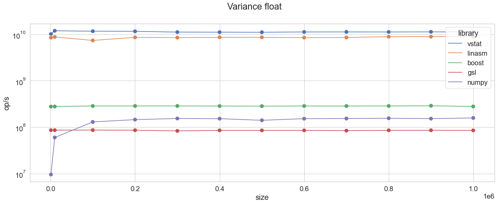
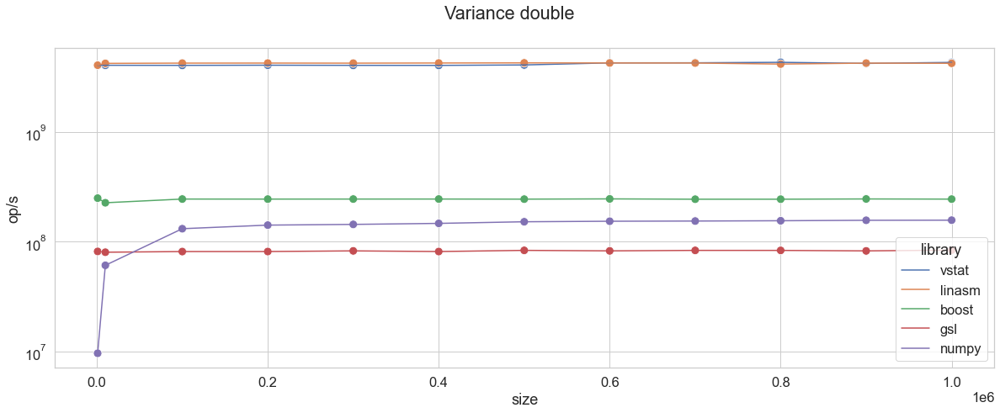
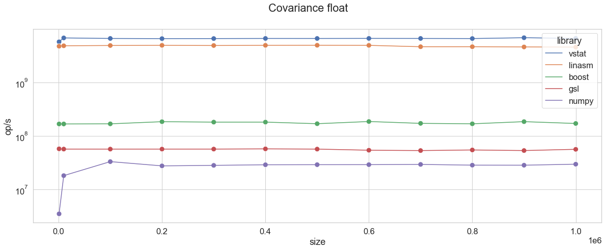
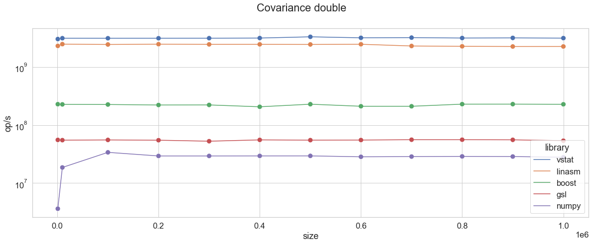

<p align="left">
    <p></p>
    
</p>

### Vectorized statistics using SIMD primitives

---

### Introduction

is a C++17 library of computationally efficient methods for calculating sample statistics (mean, variance, covariance, correlation).

- the implementation builds upon the SIMD abstraction layer provided by the _Vector Class Library_ [1]
- it uses a data-parallel _Youngs and Cramer_ [2] algorithm for numerically stable computations of sums and sums-of-squares.
- the results from independent data partitions are combined with the approach by _Schubert and Gertz_ [3].
- the methods are validated for correctness against statistical methods from the _GNU Scientific Library_ [4].

### Usage

To use this library you simply need to copy the contents of the `include` folder inside your project, and then `#include <vstat.hpp>`. Defining `VSTAT_NAMESPACE` before inclusion will allow you to set a custom namespace for the library.

Two convenience methods are provided for batch data:

- `univariate::accumulate` for univariate statistics (mean, variance, standard deviation)
- `bivariate::accumulate` for bivariate statistics (covariance, correlation)

The methods return a `statistics` object which contains all the stat values. For example:

```cpp
std::vector<float> values{ 1.0, 2.0, 3.0, 4.0 };
std::vector<float> weights{ 2.0, 4.0, 6.0, 8.0 };

// unweighted data
auto stats = univariate::accumulate<float>(values.begin(), values.end());
std::cout << "stats:\n" << stats << "\n";

count:                  4
sum:                    10
ssr:                    5
mean:                   2.5
variance:               1.25
sample variance:        1.66667

// weighted data
auto stats = univariate::accumulate<float>(values.begin(), values.end(), weights.begin());
std::cout << "stats:\n" << stats << "\n";

count:                  20
sum:                    60
ssr:                    20
mean:                   3
variance:               1
sample variance:        1.05263
```

Besides iterators, it is also possible to provide raw pointers:
```cpp
float x[] = { 1., 1., 2., 6. };
float y[] = { 2., 4., 3., 1. };
size_t n = std::size(x);

auto stats = bivariate::accumulate<float>(x, y, n);
std::cout << "stats:\n" << stats << "\n";

// results
count:                  4
sum_x:                  10
ssr_x:                  17
mean_x:                 2.5
variance_x:             4.25
sample variance_x:      5.66667
sum_y:                  10
ssr_y:                  5
mean_y:                 2.5
variance_y:             1.25
sample variance_y:      1.66667
correlation:            -0.759257
covariance:             -1.75
sample covariance:      -2.33333
```

It is also possible to use _projections_ to aggregate stats over object properties:
```cpp
struct Foo {
    float value;
};

Foo foos[] = { {1}, {3}, {5}, {2}, {8} };
auto stats = univariate::accumulate<float>(foos, std::size(foos), [](auto const& foo) { return foo.value; });
std::cout << "stats:\n" << stats << "\n";

// results
count:                  5
sum:                    19
ssr:                    30.8
mean:                   3.8
variance:               6.16
sample variance:        7.7

struct Foo {
    float value;
};

struct Bar {
    int value;
};

Foo foos[] = { {1}, {3}, {5}, {2}, {8} };
Bar bars[] = { {3}, {2}, {1}, {4}, {11} };

auto stats = bivariate::accumulate<float>(foos, bars, std::size(foos), [](auto const& foo) { return foo.value; },
                                                                       [](auto const& bar) { return bar.value; });
std::cout << "stats:\n" << stats << "\n";

// results
count:                  5
sum_x:                  19
ssr_x:                  30.8
mean_x:                 3.8
variance_x:             6.16
sample variance_x:      7.7
sum_y:                  21
ssr_y:                  62.8
mean_y:                 4.2
variance_y:             12.56
sample variance_y:      15.7
correlation:            0.686676
covariance:             6.04
sample covariance:      7.55
```

The methods above accept a batch of data and calculate relevant statistics. If the data is streaming, then one can also use _accumulators_. The _accumulator_ is a lower-level object that is able to perform calculations online as new data arrives:
```cpp
univariate_accumulator<float> acc(1.0); // it's important to initialize the accumulator!
acc(2.0); // then we can stream values to it
acc(3.0);
acc(4.0);
auto stats = univariate_statistics(acc);
std::cout << "stats:\n" << stats << "\n";

Count:                  4
Sum:                    10
Sum of squares:         5
Mean:                   2.5
Variance:               1.25
Sample variance:        1.66667
```
The template parameter tells the accumulator how to represent data internally.

- if a scalar type is provided (e.g. `float` or `double`), the accumulator will perform all operations with scalars (i.e., no SIMD).
- if a SIMD-type is provided (e.g., `Vec8f`, `Vec4d`) then the accummulator will perform data-parallel operations

This allows the user to combine accumulators, for example using a SIMD-enabled accumulator to process the bulk of the data and a scalar accumulator for the left-over points.

#### Available statistics

- univariate
    ```cpp
    struct univariate_statistics {
        double count;
        double sum;
        double ssr;
        double mean;
        double variance;
        double sample_variance;
    };
    ```

- bivariate
    ```cpp
    struct bivariate_statistics {
        double count;
        double sum_x;
        double sum_y;
        double ssr_x;
        double ssr_y;
        double sum_xy;
        double mean_x;
        double mean_y;
        double variance_x;
        double variance_y;
        double sample_variance_x;
        double sample_variance_y;
        double correlation;
        double covariance;
        double sample_covariance;
    };
    ```

### Benchmarks

The following libraries have been used for performance comparison in the univariate (variance) and bivariate (covariance) case:

- [linasm statistics](http://linasm.sourceforge.net/docs/api/statistics.php) 1.13
- [boost accumulators](https://www.boost.org/doc/libs/1_69_0/doc/html/accumulators/user_s_guide.html) 1.69
- [gnu scientific library](https://www.gnu.org/software/gsl/) 2.6
- [numpy](https://numpy.org) 1.19.4

#### Methodology

- we generate 1M values uniformly distributed between [-1, 1] and save them into a `double` and a `float` array
- increase the data size in 100k increments and benchmark the performace for each method using [nanobench](https://nanobench.ankerl.com/)

#### Notes

- we did not use MKL as a backend for numpy and gsl (expect MKL performance to be higher)
- _linasm_ methods for variance and covariance require precomputed array means, so means computation is factored into the benchmarks
- hardware: Ryzen 9 5950X






### Acknowledgements

[1] [Vector Class Library](https://github.com/vectorclass/version2)

[2] [Youngs and Cramer - Some Results Relevant to Choice of Sum and Sum-of-Product Algorithms](https://www.jstor.org/stable/1267176?seq=1)

[3] [Schubert and Gertz - Numerically stable parallel computation of (co-)variance](https://dl.acm.org/doi/10.1145/3221269.3223036)

[4] [GNU Scientific Library](https://www.gnu.org/software/gsl/)
